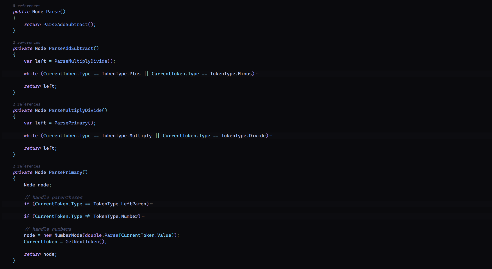

# Calculator Engine

This is a mini-project to build your own **calculator engine** using a *lexer*, *parser*, and an *evaluator* to accurately calculate any arithmetic expression.

## How it Works

Given a string representation of a basic arithmetic problem like: `2*7+3`, the process involves the following steps:

### 1. Lexer

- The purpose of the lexer is to **tokenize** the input into a collection of tokens that can be easily managed.  
- In our example, we tokenize the input into these tokens: `[2,*,7,+,3]`

**C# Implementation**:

### 2. Parser

- The parser’s main purpose is to **structure** the tokens meaningfully.  
- In this project, the parser builds an Abstract Syntax Tree (AST) to represent the expression, ensuring order of operations (PEMDAS).  

See the example below for clarity:

In this structure, each function handles a level of precedence (e.g., multiplication, addition), recursively breaking down and connecting expression components.

**C# Implementation**:

&emsp;**=>** The parser processes expression components through recursive calls that handle various operations until the structure accurately reflects the order of operations.

### 3. Evaluator

- The evaluator is the final step, consuming the AST to return a calculated value.  
- In our example, it starts at the top of the AST and recursively calculates values for each node.

**C# Implementation**:

&emsp;**=>** The evaluator recursively reduces every binary operation node to a number node until only one remains, which represents the final result.

## Testing

Testing for the calculator engine is divided into two main areas:

### Lexer Testing

- Approximately **80 test cases** cover the tokenization process.

### Parser and Evaluator Testing

- **100 basic arithmetic test cases** and **20 more complex cases** ensure accuracy.

## Notes

This project was incredibly enjoyable and provided insight into complex calculator logic, similar to a compiler. Through this, I gained a stronger grasp of **algorithms** and **recursive programming**.

I’d love to take this project further and build an equation solver!
