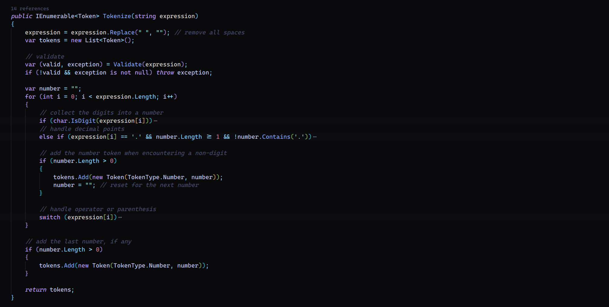
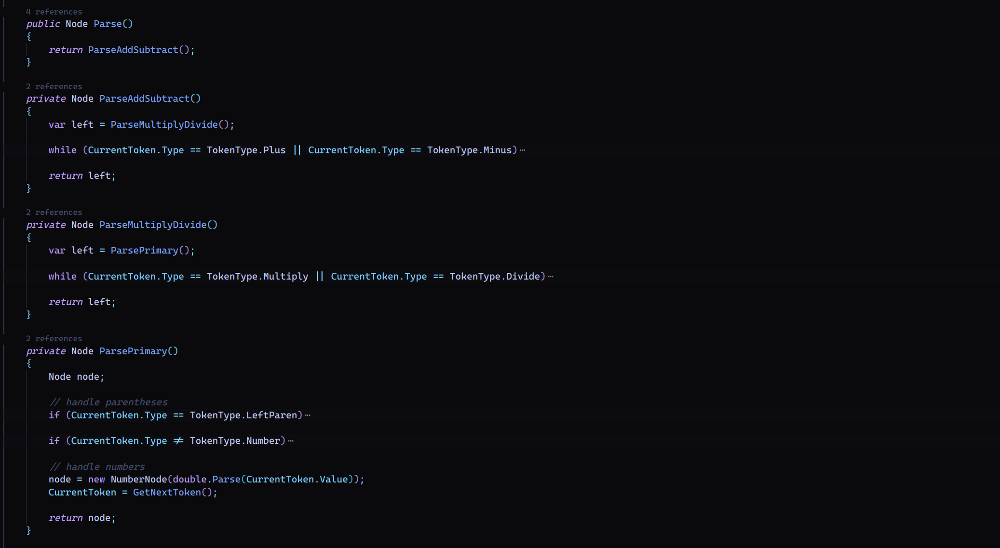
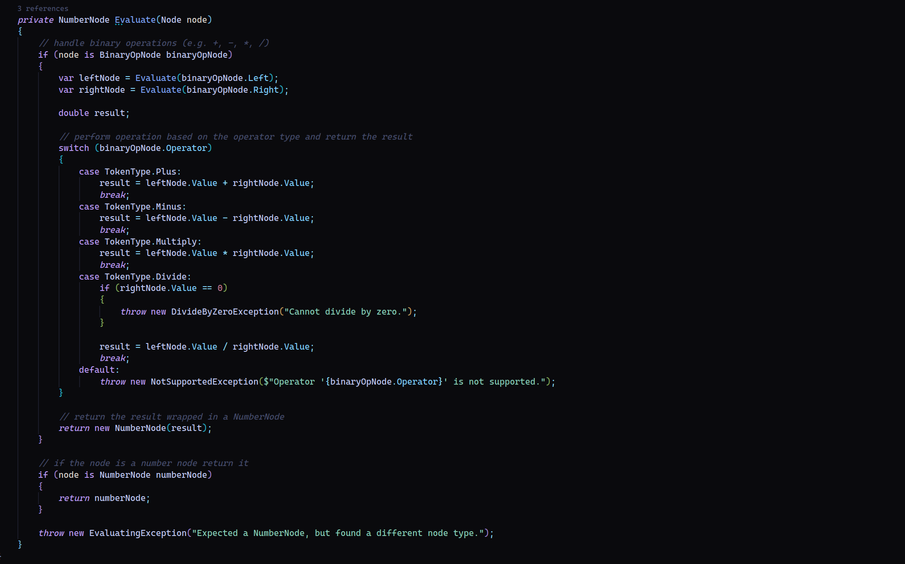

# Calculator Engine

This is a mini-project build your own ***calculator engine*** utilizing *lexer*, *parser* and an *evaluator* to calculate accurately any arithmetic expression.

## How it all works?

- We are given a string representation of a basic arithmetic problem like: `2*7+3`

### ***1. Lexer***

- The purpose of a lexer is to ***tokenize*** the input into a collection of tokens that can be easily handled and manipulated.
- In our example we will tokenize the input into these tokens: `[2,*,7,+,3]`

***C# Implementation***:

### ***2. Parser***

- The main purpose of a parser is to **connect** the tokens into a meaningful structure.
- I've chosen to combine the tokens into an Abstract Syntax Tree (AST), take a look at the image for more clarity:

- With this structure we can more accurately represent the arithmetic expression in a way that will helps us simplifying the evaluation process, and keep order of operations (PEMDAS).

***C# Implementation***

&emsp;***=>*** We break down the expression into its components (numbers, operators, etc.) by calling different functions. Each function is responsible for handling a particular level of precedence (e.g., multiplication, addition), and recursively calls other functions to process the components of the expression.

### ***3. Evaluator***

- The final key to the puzzle is to write an evaluator.
- It's main purpose is to consume the structure given by the parser and spit out a value.
- In our example it will start at the top of the AST and recursively calculate the nodes at the bottom all the way up to the top.

***C# Implementation***:

&emsp;***=>*** We basically recursively convert every binary op node to a number node and do so until only one number node left and we return its value

## Testing

- For testing the calculator engine i split the main testing into *two* areas:

### ***Lexer Testing***

- Something around *80* test cases for the tokenization process.

### ***Parser and Evaluator Testing***

- Here I utilized around *100* basic arithmetic test cases coupled with *20* a bit more complex test cases.

## Notes

This project was **very fun** and give me a great look into how more complex calculators are approached. My solution is also very similar to how a compiler works. I've also gained a better understanding of **algorithms** and **recursive programming**.
I would love to take this project a bit more far and built an equation solver!
